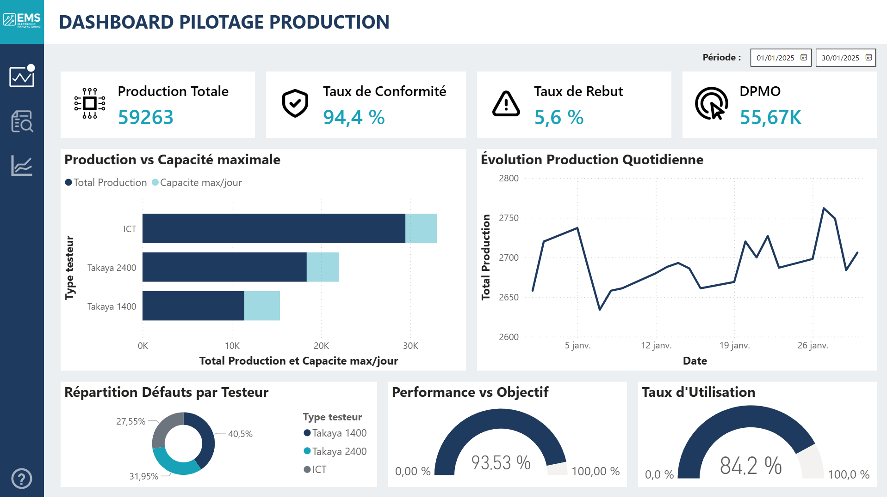

# Dashboard Production Industrielle - Projet Final M1 Power BI

## Contexte

**Type** : Projet pédagogique - Formation Data Analyst BI  
**Période** : Semaines 3-4 (Décembre 2025) 
**Objectif** : Maîtriser connexion Power BI ↔ PostgreSQL et modélisation relationnelle  
**Temps de réalisation** : ~12 heures (apprentissage + projet)

**Note** : Troisième projet formation.

---

## Architecture Technique

### Base de Données PostgreSQL

**Table 1 : production** (Données quotidiennes)
- 132 lignes
- Colonnes : date, ligne_id, shift , quantite_produite, quantite_rebuts, temps_arret_min, responsable

**Table 2 : lignes** (Référentiel)
- 3 testeurs (ICT, Takaya 1400, Takaya 2400)
- Colonnes : nom_ligne, capacite_max_jour, type_testeur, localisation, annee_installation

**Relation** : `production.ligne` → `lignes.nom` (many-to-one)

### Power BI

**Import** :
- Connexion PostgreSQL
- Mode : Import

---

## KPIs et Métriques

### Indicateurs Globaux
- **Production totale** : 59 263 unités
- **Capacité totale** : 3 200 unités/jour
- **Taux d'utilisation global** : 84,2%
- **Taux rebut moyen** : 5,6%

---

## Insights Business

### Points Clés

1. **Takaya 1400 : Taux de Rebut important**
   - Taux de Rebut : 11,7% (le plus élevé)
   - Performance faible : 82,2% de performance
   - **Risque** : Augmentation des rebuts futur fortement possible

2. **ICT & Takaya 2400 : Marge de production**
   - Taux utilisation : < 90%
   - **Opportunité** : Réallocation charge possible


### Recommandations

➡️ **Rééquilibrer charge** : Transférer production testée sur Takaya 1400 vers ICT & Takaya 2400 

---

## 📸 Aperçu Dashboard

### Vue d'Ensemble


---

**Visualisation** :
- KPI cards
- Graphiques barres groupées
- Graphiques évolution temporelle
- Jauges de taux d'utilisation
- Slicers interactifs
- Bouton d'aide pour utilisation du dashboard
- Bouton de navigation entre pages

---

## Auteur

**Bastien M**  
Ingénieur Chef de Projet avec spécialisation en cours de Data Analyst  

---

## Licence

Projet pédagogique à but non commercial.  
Données fictives créées pour l'apprentissage.

---

*Projet réalisé en Décembre 2025 - Formation Data Analyst Mois 1*

```

